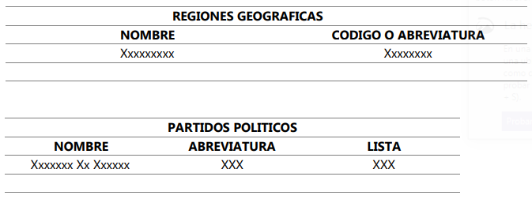

# Etapa 1
Se solicita desarrollar uno programa para efectuar el ingreso de datos:

- **Partidos políticos:** Por cada partido político se deberá ingresar el nombre (dato de tipo string distinto de vacío), la abreviatura (valor alfanumérico) y el número de lista con el que se presenta (valor entero arbitrario distinto de 0).
- **Regiones geográficas:** Se considerarán las 23 provincias y la Ciudad Autónoma de Buenos Aires.

En todos los casos se verificará la consistencia de los datos para que no existan valores repetidos, rechazándose los duplicados en cualquiera de las categorías.

Los datos se almacenarán en distintos archivos de texto con formato delimitado por punto y coma (CSV). A cada registro del archivo de regiones geográficas se le añadirá un campo adicional con un identificador único, el que se utilizará posteriormente a fin de codificar la información en los demás archivos. Para este propósito podrá utilizarse el número de registro o una abreviatura de la región. La carga de cada uno de los archivos terminará al ingresar la palabra **“FIN”**

Los cargos a elegir serán presidente y vicepresidente (código 1), diputado (2), senador (3), gobernador y vicegobernador (4). Estos datos no deberán ser ingresados ya que se encuentran preestablecidos. Para simplificar el proceso se omiten cargos de menor nivel como intendentes y concejales.

Al finalizar la carga se mostrarán los siguientes listados por pantalla:

El material a entregar consistirá en el programa fuente escrito en Python y los archivos de datos generados a partir de su utilización.

[Inicio](../README.md)